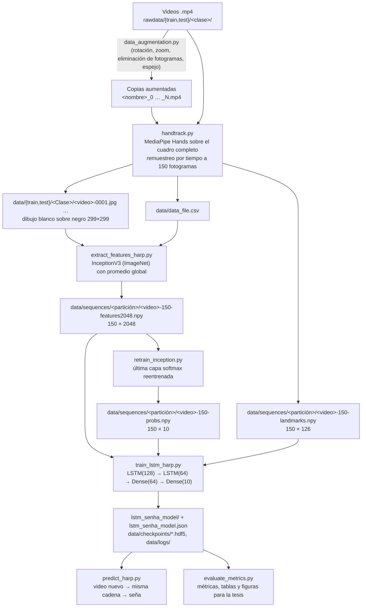

# 1. Visión general y arquitectura del sistema

## 1.1 Qué hace el sistema

El repositorio implementa un reconocedor de **señas aisladas de la Lengua de Señas Paraguaya (LSPy)** a partir de video. Cada video contiene una sola seña y el sistema le asigna una de **10 clases**:

`Agosto · Broma · Jugar · Martes · Marzo · Miercoles · Nombre · Rojo · Sabado · Soltero`

El enfoque combina tres piezas:

1. **MediaPipe Hands** detecta las manos y sus 21 puntos clave en cada fotograma, y los dibuja en blanco sobre un fondo negro de 299 × 299 píxeles. Así se elimina el fondo, la ropa y el color de la piel. También se guardan las coordenadas de los puntos.
2. **Inception V3** (preentrenada en ImageNet, transferencia de aprendizaje) convierte cada dibujo en un vector de 2048 características. Opcionalmente se reentrena su última capa para obtener, por fotograma, la probabilidad de cada seña.
3. **Una red recurrente LSTM** recibe la secuencia de vectores de un video (150 por defecto) y decide a qué seña corresponde.

> Este documento describe la versión corregida del código (6 de octubre de 2026). Los problemas de la versión anterior y los cambios aplicados están en [05 · Hallazgos y recomendaciones](05_hallazgos_y_recomendaciones.md#estado-de-aplicación-6-de-octubre-de-2026).

## 1.2 Flujo de datos de punta a punta



## 1.3 Forma de los datos en cada etapa

| Etapa | Archivo / objeto | Forma | Comentario |
|---|---|---|---|
| Video crudo | `.mp4` | p. ej. 1280 × 720 (vertical), 60 fps, ≈ 2,5 s | Hay videos de 672 × 368 a 30 fps (ver [04](04_conjunto_de_datos.md)) |
| Cuadro para MediaPipe | `numpy` | s × s × 3, s = lado mayor | Cuadro espejado y completado con bordes negros: no se deforma |
| Dibujo de manos | `.jpg` | 299 × 299 × 3 | Fondo negro, puntos y conexiones blancos, grosor 1; negro si no hay manos |
| Secuencia de imágenes | 150 `.jpg` por video | 150 × 299 × 299 × 3 | Cuadros equiespaciados entre el primero y el último del video |
| Coordenadas | `-landmarks.npy` | 150 × 126 | 2 manos × 21 puntos × (x, y, z); muñeca absoluta, resto relativo a la muñeca |
| Características de Inception V3 | `-features2048.npy` | 150 × 2048 | Promedio global de la salida 8 × 8 × 2048 |
| Probabilidades por fotograma | `-probs.npy` | 150 × 10 | Salida de la última capa reentrenada |
| Entrada de la LSTM | lote | (n, 150, d), d = 2048, 10 o 126 | Según `--data-type` |
| Salida del modelo | vector | 10 | Probabilidad de cada seña |

## 1.4 Arquitectura del extractor (extract_features_harp.py y retrain_inception.py)

| Capa | Salida | Parámetros | ¿Entrenada? |
|---|---|---|---|
| InceptionV3 (`include_top=False`, pesos ImageNet) | 8 × 8 × 2048 | 21 802 784 | En ImageNet; congelada |
| GlobalAveragePooling2D (`pooling='avg'`) | 2048 | 0 | — |
| Dropout(0.5) + Dense(10, softmax) — `retrain_inception.py` | 10 | 20 490 | **Sí, con los fotogramas de entrenamiento** |

La última fila es la “nueva capa final” de la transferencia de aprendizaje: se entrena con los fotogramas de los videos de entrenamiento (cada uno etiquetado con la seña de su video), sin los de validación ni prueba. Las probabilidades de los videos de entrenamiento se calculan fuera de pliegue para que no sean más confiadas que las que se verán al predecir.

> En la versión anterior, en lugar del promedio global había `Flatten` → `Dense(10, softmax)` **sin entrenar** (pesos aleatorios, distintos en cada ejecución). Ver [05 · H1](05_hallazgos_y_recomendaciones.md#h1).

## 1.5 Arquitectura del clasificador (train_lstm_harp.py)

**`--arch ligera` (por defecto)**, con entrada de 2048 valores por fotograma:

| # | Capa | Salida | Parámetros |
|---|---|---|---|
| 1 | LSTM(128, `return_sequences=True`, `dropout=0.3`) | 150 × 128 | 1 114 624 |
| 2 | LSTM(64, `dropout=0.3`) | 64 | 49 408 |
| 3 | Dense(64, ReLU) | 64 | 4 160 |
| 4 | Dropout(0.5) | 64 | 0 |
| 5 | Dense(10, softmax) | 10 | 650 |
| | **Total** | | **1 168 842** |

**`--arch original`** (la de la versión anterior): LSTM(2048, `dropout=0.5`) → Dense(512, ReLU) → Dropout(0.5) → LSTM(256) → Dropout(0.5) → LSTM(128) → Dropout(0.5) → Dense(10, softmax).

| Entrada por fotograma | `ligera` | `original` |
|---|---|---|
| 2048 (`features2048`) | 1 168 842 | 35 597 578 |
| 126 (`landmarks`) | 184 778 | 19 852 554 |
| 10 (`probs` o `features`) | 125 386 | 18 902 282 |

Configuración de entrenamiento:

| Hiperparámetro | Valor |
|---|---|
| Función de pérdida | entropía cruzada categórica |
| Optimizador | Adam, tasa 1e-4 (`--lr`; la versión anterior usaba 1e-5) |
| Métricas | exactitud, exactitud top-5 (`top_k_categorical_accuracy`, k = 5 por defecto) |
| Tamaño de lote | 32 |
| Épocas | hasta 100 |
| Parada temprana | `EarlyStopping(patience=30, restore_best_weights=True)` sobre `val_loss` |
| Conjunto de validación | 20 % de los videos originales de train (al menos uno por clase), cada uno con sus copias aumentadas |
| Conjunto de prueba | se evalúa una sola vez, al final |
| Guardado | mejor `val_loss` en `data/checkpoints/` y en `lstm_senha_model/`, más `lstm_senha_model.json` |
| Semilla | 42 (`--seed`) |

## 1.6 Artefactos que genera el pipeline

```
inception-v3/
├── rawdata/                     # videos originales (train / test; trainaug = copias de la versión anterior)
├── rawdata_aug/                 # originales + copias de data_augmentation.py (entrada de handtrack.py)
├── personas_video.csv           # persona que signa cada video original
├── data/                        # salida de handtrack.py (ignorada por git)
│   ├── data_file.csv            # una fila por video: split, clase, nombre, n, con mano, total, fps
│   ├── train/<Clase>/*.jpg      # dibujos de manos, 150 por video
│   ├── test/<Clase>/*.jpg
│   ├── sequences/{train,test}/*.npy  # -landmarks, -features2048 y -probs
│   ├── inception_head.keras     # última capa reentrenada de Inception V3 (+ .json)
│   ├── checkpoints/*.hdf5       # mejores pesos según val_loss
│   └── logs/                    # TensorBoard (lstm-*/) y CSVLogger (*.log)
├── lstm_senha_model/            # modelo final (formato SavedModel)
├── lstm_senha_model.json        # clases, representación y configuración del modelo
└── metricas/<fecha_hora>/       # salida de evaluate_metrics.py
```

## 1.7 Dependencias principales

| Biblioteca | Versión fijada | Uso |
|---|---|---|
| Python | 3.10 (el `.venv` usa 3.10.22) | TensorFlow 2.15 admite 3.9 – 3.11 |
| TensorFlow / Keras | 2.15.1 / 2.15.0 | Inception V3 y LSTM (API de Keras 2) |
| MediaPipe | 0.10.14 | `mp.solutions.hands` (API “legacy”) |
| OpenCV (`opencv-contrib-python`) | 4.10.0.84 | lectura y escritura de video e imágenes; aumento de datos |
| NumPy | 1.26.4 | TF 2.15 no funciona con NumPy 2 |
| scikit-learn | 1.5.2 | `evaluate_metrics.py` |
